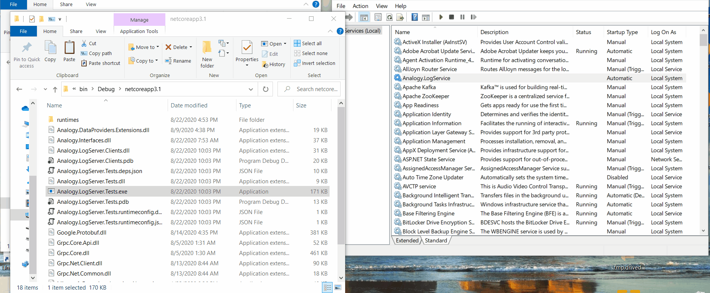

# Analogy Log Server  [](https://app.codacy.com/gh/Analogy-LogViewer/Real-Time-Log-Server?utm_source=github.com&utm_medium=referral&utm_content=Analogy-LogViewer/Real-Time-Log-Server&utm_campaign=Badge_Grade)

<p align="center">
    
[](https://gitter.im/Analogy-LogViewer/community?utm_source=badge&utm_medium=badge&utm_campaign=pr-badge)  
[](https://dev.azure.com/Analogy-LogViewer/Analogy%20Log%20Viewer/_build/latest?definitionId=40&branchName=master)
    
</a>

<a href="https://github.com/Analogy-LogViewer/Analogy.LogViewer.gRPCLogServer/blob/master/LICENSE.md">
    
</a>
</p>

gRPC Log Server (Windows Services) to receive and then forward messages to Analogy Log Viewer.

Analogy Log server supports to following real time data:
- Windows Event logs (configurable in the server settings)
- Any gRPC client that implements the Protofile (currentlly there are fully implemented C#, Python and JAVA (Poc) clients)

The following modules exists:
| Nuget   |      Version      |  Description |
|----------|:-------------:|------|
| [Analogy.LogViewer.gRPC](https://www.nuget.org/packages/Analogy.LogViewer.gRPC/) |   [](https://www.nuget.org/packages/Analogy.LogViewer.gRPC/) | Primary Analogy Log Viewer grRPC providers |
| [Analogy.LogServer](https://www.nuget.org/packages/Analogy.LogServer/) |   [](https://www.nuget.org/packages/Analogy.LogServer/) | A windows Service for receiving logs |
| [Analogy.LogServer.Clients](https://www.nuget.org/packages/Analogy.LogServer.Clients/) |   [](https://www.nuget.org/packages/Analogy.LogServer.Clients) | gRPC client to pull back messages from Analogy Service |
| [Analogy.AspNetCore.LogProvider](https://www.nuget.org/packages/Analogy.AspNetCore.LogProvider/) |   [](https://www.nuget.org/packages/Analogy.AspNetCore.LogProvider) | AspNetCore Logger provider |
| [NLog Target](https://github.com/Analogy-LogViewer/Analogy.LogViewer.NLog.Targets) |   [](https://www.nuget.org/packages/Analogy.LogViewer.NLog.Targets) | NLog target to stream logs to Analogy |
| [Serilog Sink](https://github.com/Analogy-LogViewer/Analogy.LogViewer.Serilog.Sinks) |   [](https://www.nuget.org/packages/Analogy.LogViewer.Serilog.Sinks) | Serilog Sink for sending logs to Analogy |

There  are, currently, 4 types of gRPC clients:

| Data Provider   |      Nuget Version |
|----------|:---------------|
| [NLog Target](https://github.com/Analogy-LogViewer/Analogy.LogViewer.NLog.Targets) | NLog target to stream logs to Analogy|
| [Serilog Sink](https://github.com/Analogy-LogViewer/Analogy.LogViewer.Serilog) | Serilog Sink for sending logs to Analogy|
| [Analogy.AspNetCore.LogProvider](https://github.com/Analogy-LogViewer/Analogy.AspNetCore.LogProvider/) | Custom logging provider in Asp.Net Core that write logs to Analogy |
| [Python Logging](https://github.com/Analogy-LogViewer/Analogy-Python-Logging/) | Python gRPC client logger that sends logs to Analogy |

Windows Service:



With Analogy Log server you can stream log messages from any [Supported languages](https://grpc.io/docs/languages/) and have them saved in a log files and view in real time using [Analogy Log Viewer](https://github.com/Analogy-LogViewer).

## Usage

Once you have setup Analogy Log Server you can start sending messages to it:


- NLog Target: 
Add nuget [Analogy.LogViewer.NLog.Targets](https://www.nuget.org/packages/Analogy.LogViewer.NLog.Targets/)
 In your nlog.config add:
 ```xml
<?xml version="1.0" encoding="utf-8" ?>
<nlog xmlns="http://www.nlog-project.org/schemas/NLog.xsd"
      xmlns:xsi="http://www.w3.org/2001/XMLSchema-instance"
      autoReload="true"
      internalLogLevel="warn">

  <extensions>
    <add assembly="NLog.Web.AspNetCore"/>
    <add assembly="Analogy.LogViewer.NLog.Targets"/>
  </extensions>
 
  <targets>
    <!-- write logs to file  -->
    <target xsi:type="File" name="allfile"
        fileName="c:\KALPA\logs\${processname:fullName=false}-KX.nlog"
        layout="${longdate}|${uppercase:${level}}|${logger}|${message}${exception:format=tostring}|${processname:fullName=false}|${processid}"
        keepFileOpen="false"
        archiveFileName="c:\KALPA\logs\${processname:fullName=false}-KX-${shortdate}.{##}.nlog"
        archiveNumbering="Sequence"
        archiveEvery="Day"
        maxArchiveFiles="100"
        archiveAboveSize="30000000">
    </target>
    <!-- write logs to Analogy Log Server  -->
    <target xsi:type="NlogAnalogyGRPCTarget" name="NLogToAnalogyGRPCTarget"
            layout="${longdate}|${uppercase:${level}}|${logger}|${message} ${exception:format=tostring}|${processname:fullName=false}|${processid}">
      <contextproperty name="MachineName" layout="${machinename}" />
      <contextproperty name="ThreadId" layout="${threadid}"/>
      <contextproperty name="ProcessId" layout="${processid}" />
      <contextproperty name="callsite" layout="   ${callsite:className=true:fileName=true:includeSourcePath=true:methodName=true}" />
      <contextproperty name="ProcessName" layout="${processname:fullName=false}" />
    </target>
  </targets>

  <rules>
    <logger name="*" minlevel="Trace" writeTo="allfile" />
    <logger name="*" minlevel="Trace" writeTo="NLogToAnalogyGRPCTarget" />
  </rules>
</nlog>
```
 
-  Serilog Sink: 
Add nuget [Analogy.LogViewer.Serilog.Sinks](https://www.nuget.org/packages/Analogy.LogViewer.Serilog.Sinks//)


- Analogy.AspNetCore.LogProvider:
Add Nuget package [Analogy.AspNetCore.LogProvider](https://www.nuget.org/packages/Analogy.AspNetCore.LogProvider/) and then add to the Configure method the following in te Startup.cs

```csharp

 public void Configure(IApplicationBuilder app, IWebHostEnvironment env, ILoggerFactory loggerFactory)
 {
     loggerFactory.AddAnalogyLogger(new AnalogyLoggerConfiguration
     {
         LogLevel = LogLevel.Trace,
         EventId = 0,
         AnalogyServerUrl = "http://localhost:6000"
      });
     }

```

- Python logging: go to [Python Logging](https://github.com/Analogy-LogViewer/Analogy-Python-Logging/) for more information.
